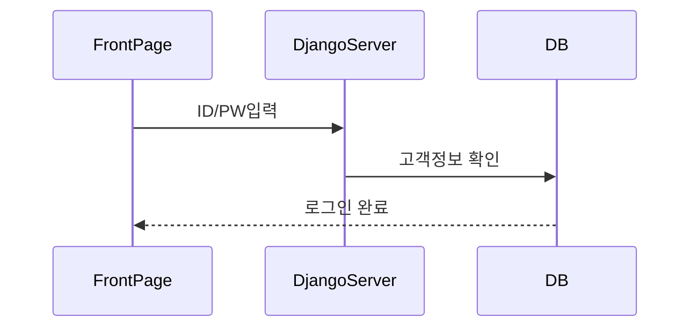
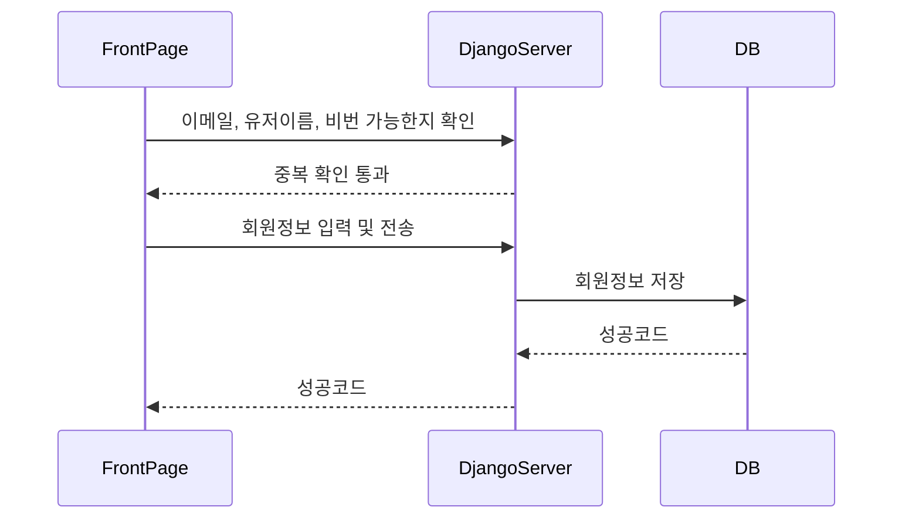
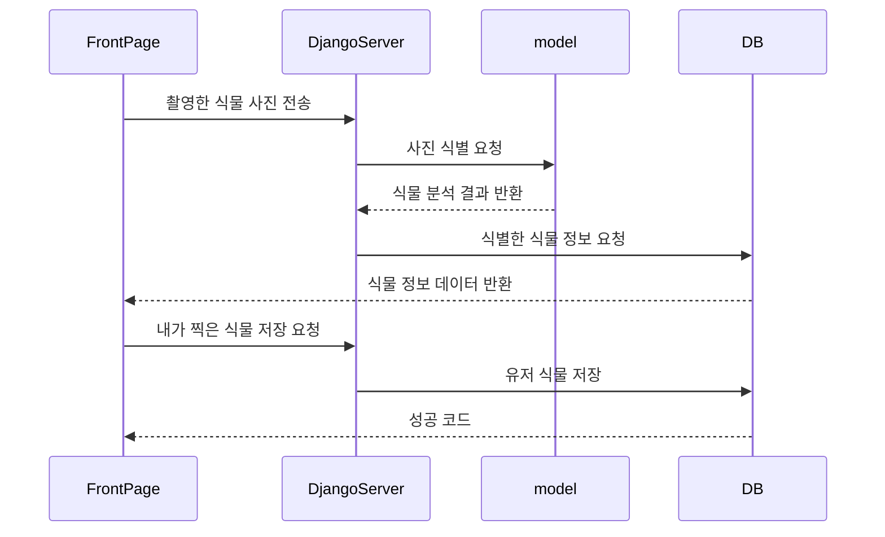
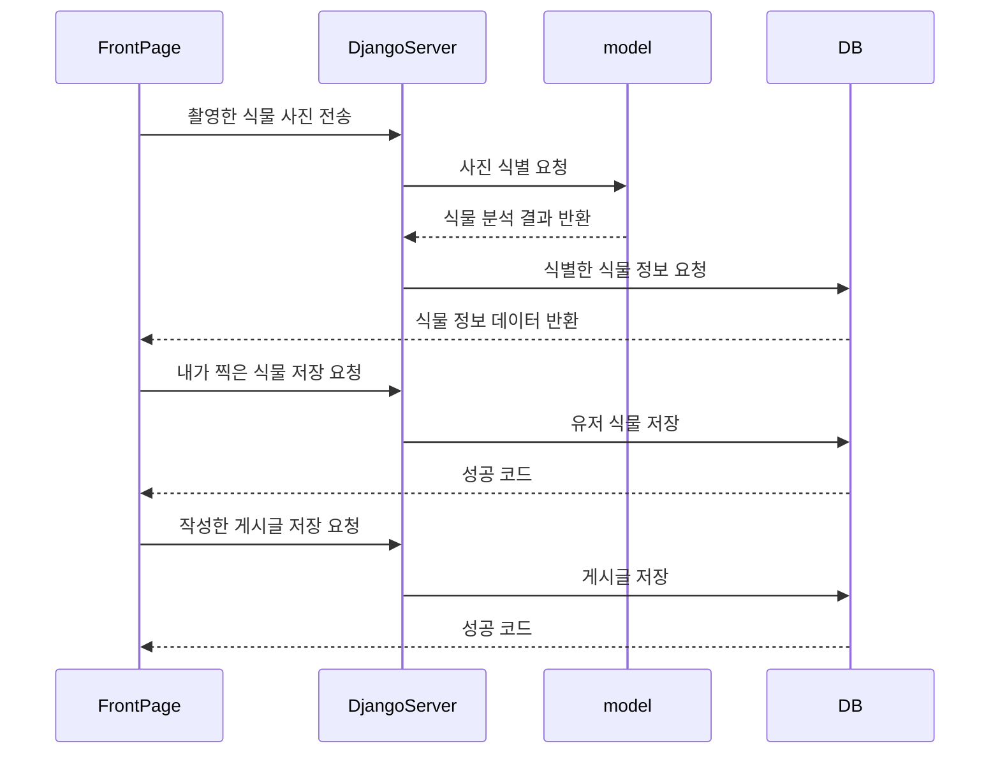
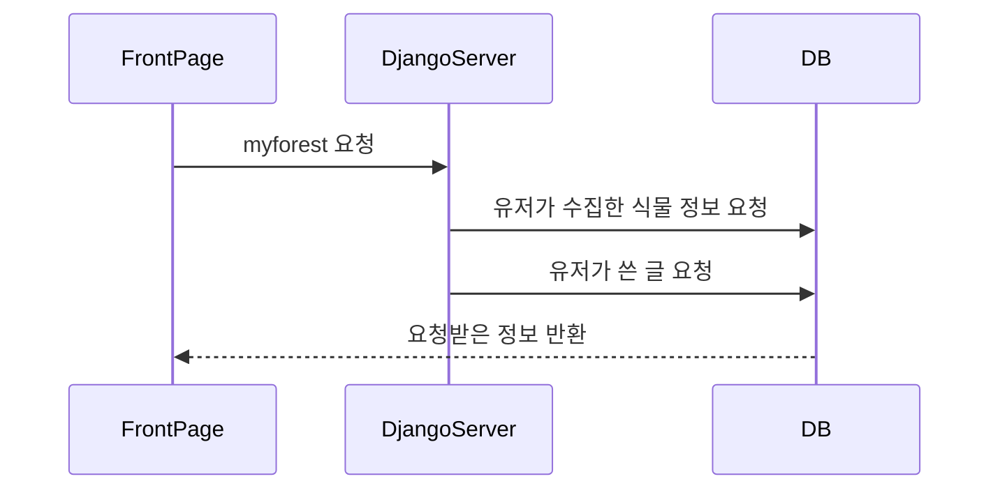
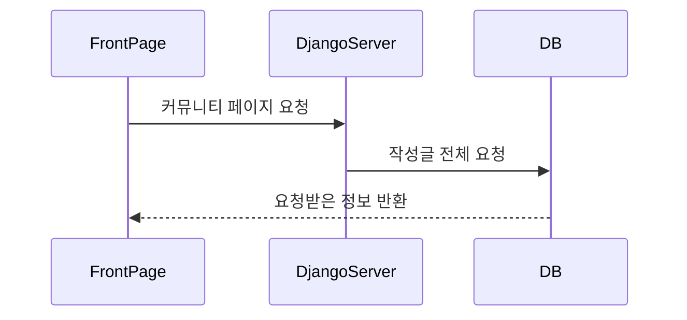
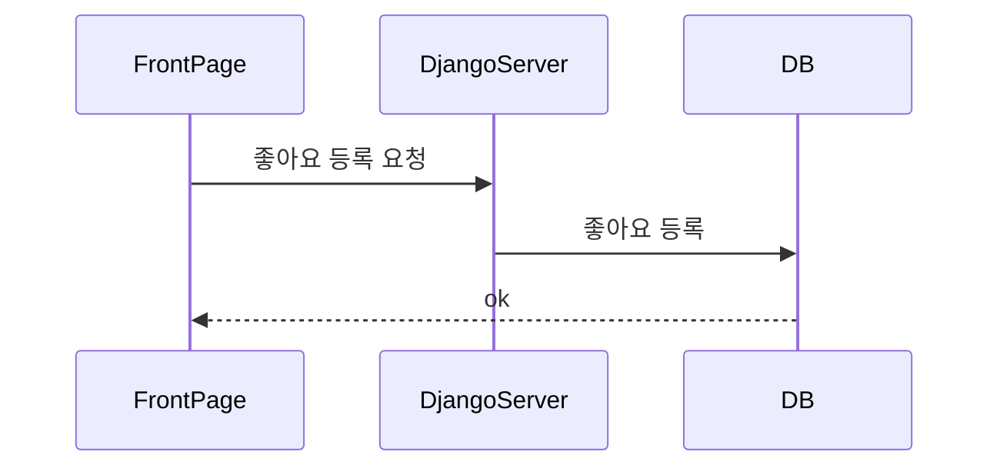

# ForestGo

## 1. 로그인

로그인은 간단하게 ID, PW 입력을 통해 DB를 확인하여 로그인을 진행한다.

## 2. 회원 가입

이메일, 유저 이름이 중복되지 않고 비밀번호가 충분히 복잡한 경우 회원가입이 된다.

## 3. 식물 촬영 및 저장

식물을 촬영하면 해당 식물을 인식하여 식물 데이터를 조회하고 정보를 반환해준다.

### 저장만 하는 경우

### 저장 후 글쓰기

## 4. 내 수집물 조회 (myforest 페이지)

myforest 페이지에 들어가면 유저가 수집한 식물 정보, 작성한 글 정보, 메달, 통계 등을 보여준다.

## 5. 커뮤니티 조회 (DISCOVERY 페이지)

유저들이 작성한 글들을 보여준다.

## 6. 댓글 달기

유저가 올린 게시글에 댓글을 달 수 있다. 답글을 달 수 있으며, 자신이 작성한 댓글을 삭제할 수 있다.

## 7. 좋아요 달기

유저가 올린 게시글 또는 댓글에 좋아요를 달 수 있다. 좋아요를 취소할 수 있다.

